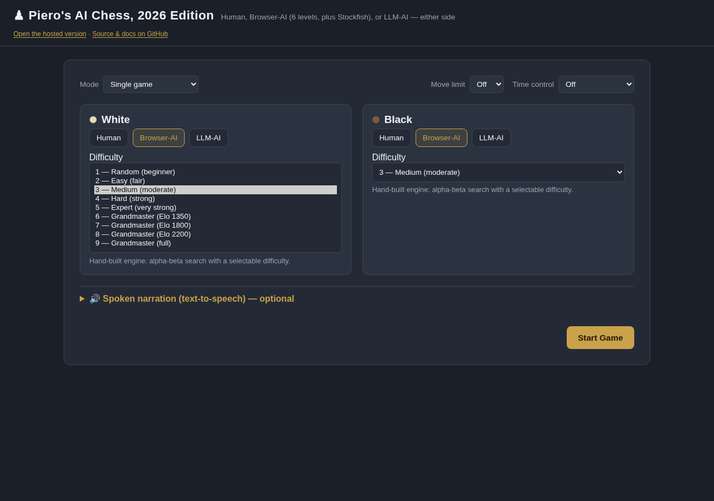
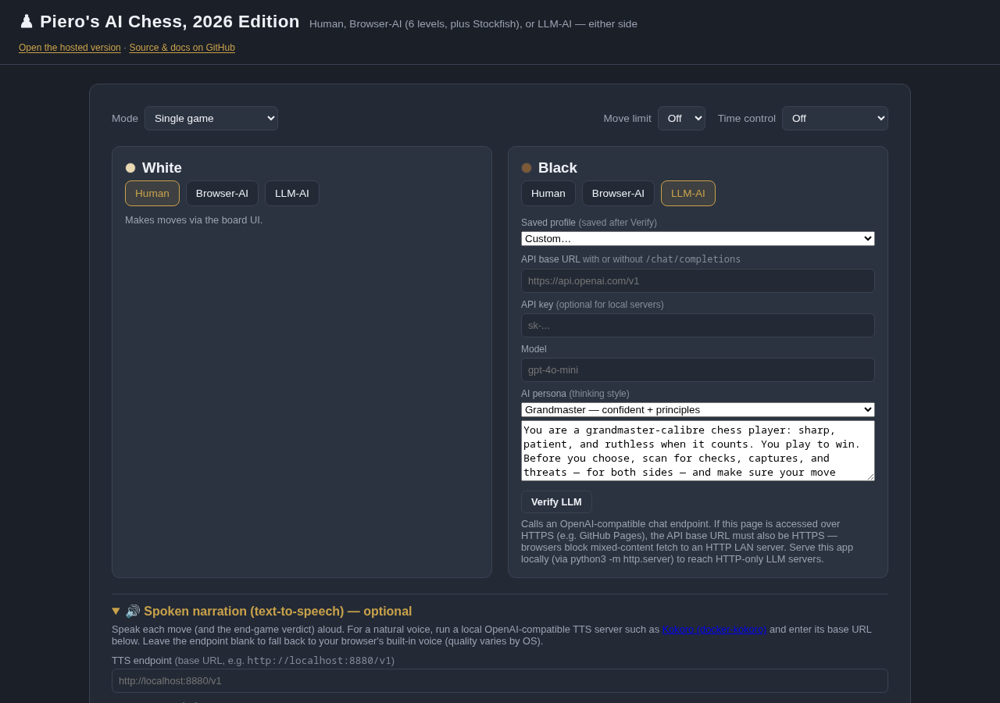
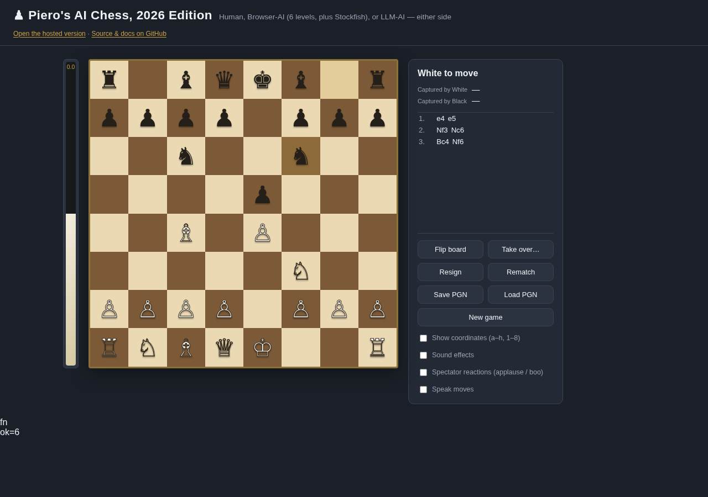

# Piero's AI Chess, 2026 Edition

▶️ **Play it now:** <https://piebru.github.io/AI-Chess/chess.html>

📖 **Read more:**
- Blog — 🇬🇧 [English](https://piebru.github.io/AI-Chess/docs/onefile-chess-blog.html) · 🇮🇹 [Italiano](https://piebru.github.io/AI-Chess/docs/onefile-chess-blog_it.html)
- Player's guide — 🇬🇧 [English](https://piebru.github.io/AI-Chess/docs/onefile-chess-guide.html) · 🇮🇹 [Italiano](https://piebru.github.io/AI-Chess/docs/onefile-chess-guide_it.html)
- For kids — 🇬🇧 [English](https://piebru.github.io/AI-Chess/docs/onefile-chess-kids.html) · 🇮🇹 [Italiano](https://piebru.github.io/AI-Chess/docs/onefile-chess-kids_it.html)

A single-file chess app built with vanilla HTML, CSS, and JavaScript — no build step, no frameworks, no npm. `chess.html` **is the whole app**: open it and play. The only other files in the repo are the Stockfish engine binaries, which are **optional** and used **only** for Grandmaster mode — every other mode (Human, Browser-AI, LLM-AI) runs entirely from that one file.

I made it to have fun while entertaining my grandkids on both playing and designing such software, and to have an empirical benchmark platform to measure my self-hosted systems' quality about LLM inferencing, harnesses, scaffolds, software engineering, and coding. Two goals, in priority order: **entertain** (a beginner should have a winnable, enjoyable game; a strong player should get a genuine challenge) and **evaluate AI "intelligence"** — concretely, how the engines and LLMs think move-to-move.

NOTE: it's almost impossible for me to manually test all features and options. EXPECT BUGS and please open an issue if you find one, or want to suggest new features. Tested mainly with **LibreWolf** (Firefox), occasionally with **Ungoogled-Chromium** (Chromium); other modern browsers should work but aren't regularly checked.

## Screenshots

| Setup: Browser-AI levels | Setup: LLM-AI + TTS | Board mid-game |
|---|---|---|
|  |  |  |

## Features

- **Single-file app** — everything lives in one `chess.html`: no build step, no frameworks, no CDN for core play. (The Stockfish files are an optional companion for Grandmaster mode only — see [Play](#play).)
- **Hand-rolled 0x88 rules engine** — legal move generation, FEN/SAN, check/checkmate/stalemate, and draws (fifty-move rule, insufficient material, threefold repetition). No `chess.js` dependency.
- **Three controller types, pickable per side:**
  - **Human** — local two-player on one board.
  - **Browser-AI** — a hand-built alpha-beta search (null-move pruning, late-move reductions, transposition table) across nine levels: **1 Random → 5 Expert** (wide-random Beginner up to full-depth Expert), then **6–9 Grandmaster** = Stockfish over UCI, Elo-limited at **1350 / 1800 / 2200** and finally **full strength** — the strongest engine there is. Node budgets (not wall-clock) make each level play the same strength on any CPU.
  - **LLM-AI** — any OpenAI-compatible endpoint *you* configure, with a per-side **system prompt** (5 built-in personas or custom). The model is given the full legal move list (constrained choice) with a corrective retry on an illegal reply and a graceful local fallback so a flaky endpoint never kills a game. The API base URL takes a trailing `/chat/completions` or not (paste either form); the per-side **Verify** button probes your endpoint, key, and model first, and runs automatically on Start for every LLM side — so a dead endpoint is caught before the board, not mid-game. Every config that passes Verify is remembered as a **saved profile**, selectable from a per-side dropdown (or pick **Custom…** to type fresh) — so a known-good endpoint is one click to reuse next time.
- **Mix any two sides** — Human vs Normal, Stockfish vs LLM, or sit back and **spectate AI vs AI**.
- **Engine transparency** — eval bar, per-move quality tags (`best` / `good` / `inaccuracy` / `mistake` / `blunder`), and a "thinking…" indicator, so you can *see* how each side reasons.
- **Plain-English move narration + spoken TTS** — every move is described in words under the board (and, if you toggle it on, spoken aloud via a local [Kokoro](https://github.com/hwdsl2/docker-kokoro) / OpenAI-compatible TTS server, or your browser's built-in voice).
- **Tournament / benchmark mode** — when a side is LLM-AI, run a gauntlet that plays the LLM against every difficulty (Random → Grandmaster full) in an **adaptive climb**, then prints an **estimated Elo** (maximum-likelihood, the same method as the public [LLM-Chess](https://github.com/maxim-saplin/llm_chess) leaderboard) plus instruction-following, move-quality, and efficiency diagnostics, auto-saved to a text file.
- **Match mode** — a best-of-N head-to-head between the two configured sides (two LLMs, two prompts on one LLM, or LLM vs engine). It returns a **relative ranking** the single-game can't: an Elo *difference* (logistic, from the score) and a **likelihood-of-superiority** (Bayesian, from the decisive games), plus per-side move-quality and instruction-following diagnostics. Complementary to the gauntlet — the gauntlet finds *how strong* one LLM is (absolute Elo, Stockfish-anchored); a match finds *which of two is stronger* (relative).
- **Chess clock, PGN, and quality-of-life** — optional FIDE-style per-side clock (Bullet/Blitz/Rapid/Classical); **save/load a game as PGN** with view-only replay; drag-and-drop *or* click moves; confirm-before-discard on New/Rematch/Resign/Stop; **take over a side mid-game** (swap any side's controller and resume from the current position).
- **Sound & crowd** — off-by-default sampled piece sounds (move/capture/check/game-end) and an opt-in "spectator reactions" layer (crowd applause, boos, cheers keyed to move quality, firing on big captures).
- **Web Workers** — the Normal engine and Stockfish run off the main thread, so the UI never blocks.
- **Offline-first** — Human vs Human and Human vs Normal need no network. Grandmaster loads a local Stockfish runtime bundle when present (else tries a CDN); LLM-AI needs your configured endpoint.
- **Setup persistence** — your per-side controller choices, LLM config, and game mode (Single / Tournament / Match) are saved to `localStorage` and proposed as defaults next time; the very first run opens on Human vs Browser-AI. Verified LLM endpoints are also saved as reusable profiles.

## Play

**Quick start** — `chess.html` alone is a complete game. Open it in any modern browser (`firefox chess.html`, or just double-click): Human vs Human, Human vs Browser-AI, and LLM-AI all run from that one file via `file://`, no server needed.

**Grandmaster mode is the one exception** — it needs the Stockfish engine, shipped as two optional companion files next to `chess.html` (`stockfish-18-lite-single.{js,wasm}`, GPL-3.0). They load only when a side is set to Grandmaster; delete them and every other mode keeps working unchanged. Grandmaster also requires serving over HTTP — browsers block its background Worker from a `file://` page. Over HTTP it runs fully offline from the local bundle:

```bash
python3 -m http.server 8000   # then open http://localhost:8000/chess.html
```

> **Local LLM needs HTTP too.** To reach a local HTTP inference server (Ollama, LM Studio, llama.cpp, …) serve the app over HTTP as above — browsers block HTTPS→HTTP calls (mixed content) outright, and `file://`→HTTP is unreliable, so HTTP serving is the safe path for local-LLM play.

**Cloud is supported — never required.** LLM-AI is built around a local or self-hosted OpenAI-compatible server: that is the intended, fully-offline path and the spirit of this project. But running your own inference server takes hardware and setup that not everyone has, so the app also works with any cloud-hosted OpenAI-compatible endpoint — and as of today (July 2026), several have been verified compatible with the app's requirements; every one of them offers a **free tier** that proved **good enough to play**. Their use is **entirely optional**: the app never requires a cloud account, never collects telemetry, and keeps your key only in your own browser. If you can self-host, do; if you can't, the cloud path is there so the door stays open for you.

## Specs

Full design documentation (Spec-Driven Development):
- [`specs/chess-app-spec.md`](specs/chess-app-spec.md) — requirements, the contract
- [`specs/chess-app-prd.md`](specs/chess-app-prd.md) — UX, flows, behavior
- [`specs/chess-app-tdd.md`](specs/chess-app-tdd.md) — architecture, design, schemas
- [`AGENTS.md`](AGENTS.md) — operating manual for the project

User-facing pages (blog, player's guide, kids): see [`docs/`](docs/).

## Development environment

**The entire project — code and all documentation — was developed using only open-source tools, including the LLM.** The main components of the development system:

- **[Arch Linux](https://archlinux.org/)** — the development OS.
- **[pi](https://pi.dev)** — the coding agent that drove the work.
- **[Feynman](https://github.com/companion-inc/feynman)** skills — for deep-research and other design tasks.
- **[YAGNI](https://en.wikipedia.org/wiki/You_aren%27t_gonna_need_it)** methodology, enforced by **[ponytail](https://github.com/DietrichGebert/ponytail)** — keeping every change the shortest working diff.
- **ssh + [tmux](https://github.com/tmux/tmux)** — persistent remote coding sessions.

The LLM backing `pi` was a **self-hosted [llama.cpp](https://github.com/ggml-org/llama.cpp)** server running **Qwen-3.6-27B_UD-Q8 by Unsloth** — no cloud APIs involved. Part of the point: this project is itself an empirical benchmark for self-hosted LLM inferencing and agentic software engineering.

## Acknowledgments

This whole thing — the app, the docs, the process — was created with a fully open-source, self-hosted toolchain: Arch Linux, the pi coding agent, Feynman skills, ponytail discipline, tmux persistence, and a llama.cpp server running Qwen-3.6-27B as the reasoning engine behind it all. Building on open giants is the only way to build this much, this fast, with nothing but free software. (The full roll-call is at the bottom of the section.)

On top of that, this project stands on the shoulders of two open-source efforts:

- **[Stockfish](https://github.com/official-stockfish/Stockfish)** (GPL-3.0) — the strongest chess engine there is, vendored as a WebAssembly build and powering Grandmaster mode (levels 6–9).
- **[LLM Chess](https://github.com/maxim-saplin/llm_chess)** — the public LLM-vs-engine benchmark whose maximum-likelihood Elo method and adaptive level-selection heuristic inspired the Tournament gauntlet and its diagnostics.

Sound effects and crowd reactions are sampled recordings under permissive licences (CC0 / Pixabay Licence), embedded as base64 data URIs so the app stays self-contained and offline.

And beyond the chess itself, the very **making** of this app rested on giants too: **[Arch Linux](https://archlinux.org/)**, the **[pi](https://pi.dev)** coding agent with its **[Feynman](https://github.com/companion-inc/feynman)** skills, the **[ponytail](https://github.com/DietrichGebert/ponytail)** discipline (YAGNI, shortest-working-diff), **[tmux](https://github.com/tmux/tmux)** for tireless remote sessions, and a self-hosted **[llama.cpp](https://github.com/ggml-org/llama.cpp)** running **Qwen-3.6-27B (UD-Q8 by Unsloth)** as the working brain behind `pi`. Every one of these is free and open — and it really *is* easier to build something when you're already standing on the shoulders of giants.

## License

Licensed under the [GNU General Public License v3.0](LICENSE).

This project vendors the **Stockfish** runtime (`stockfish-18-lite-single.{js,wasm}`, GPL-3.0) directly in the repository, so the whole project is GPL-3.0 — consistent copyleft across the app and the bundled engine. Those files are an optional companion (Grandmaster mode only); `chess.html` itself is a complete single-file app without them.
